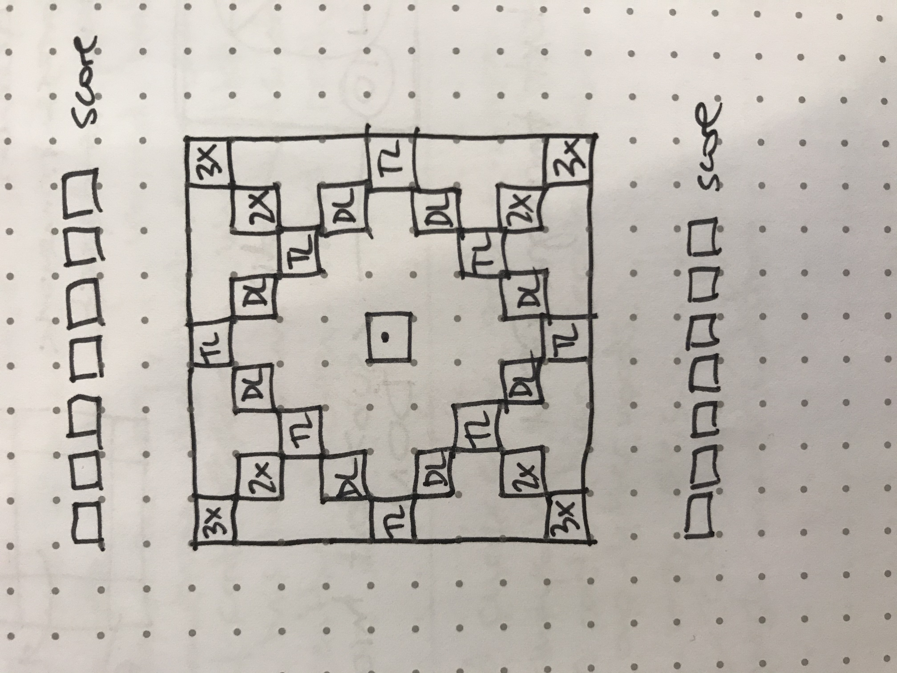
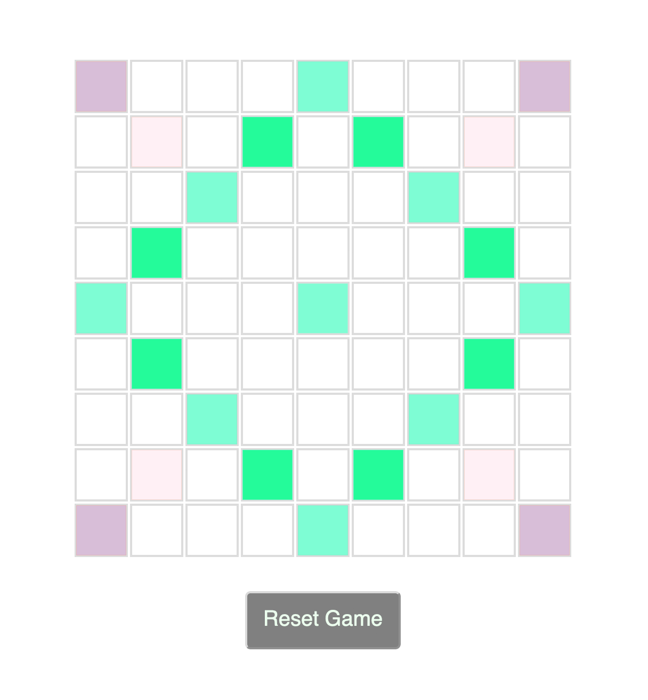

Scrabble
=========

Wireframes:
-----------

Gameplay:
---------
Players start with 7 random tiles each out of 100 Scrabble tiles
The board is 9 x 9 squares with some tiles that double or triple the value of the tile or word placed on them
Players take turns to place any number of tiles on the board
5 rounds
Each turn the game deals extra tiles to get your total back up to 7
Game checks placed tiles, scores and indicates legit move
When move is submitted, score is updated
Computer generates and plays a move
At the end of 5 rounds, display who won and offer to reset and play again
Keep track of how many games have been won

Check moves:
------------
Tiles must be adjacent to eachother or be in a straight line through existing tiles
Tiles must be adjacent to previously played tiles (except first turn)
All formed words must exist in scrabble dictionary

Display:
--------
Round 
Player scores
Rounds won

Bonus functionality:
--------------------
Shuffle your tiles around
Time limit turns
Drag tiles onto the board
Recall all your tiles off the board with one button
Computer move difficulty to increase and vary around the level where the player is
After the game is over see an alphabetical list of all words played with their definitions
After the game is over see a short list of unusual or long words that could have been played or maybe a 'hint' button while you're playing
